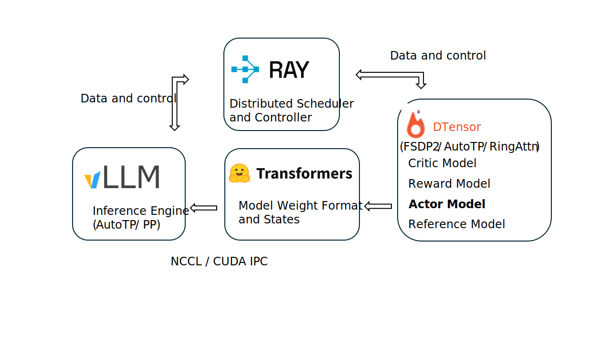

<div align="center">
    
</div>
<div align="center">
<p align="center">
      <a href="https://github.com/OpenRLHF/OpenRLHF/graphs/contributors">
        
      </a>
      <a href="https://github.com/OpenRLHF/OpenRLHF/issues">
        
      </a>
      <a href="https://github.com/OpenRLHF/OpenRLHF/discussions">
        
      </a>
      <a href="https://github.com/OpenRLHF/OpenRLHF/pulls">
        
      </a>
      <a href="https://github.com/OpenRLHF/OpenRLHF/stargazers">
        
      </a>
      <a href="https://deepwiki.com/OpenRLHF/OpenRLHF"></a>
      <br>
      <em>オープンソース / 包括的 / 軽量 / 使いやすい</em>
    </p>
</div>

<hr>

<span>[ <a href="README.md">English</a> | <a href="README_zh.md">中文</a> | 日本語 ]</span>

OpenRLHFは、**Ray + vLLM分散アーキテクチャ**と**統一エージェントベース設計パラダイム**を組み合わせた**最初の**高性能で本番環境対応のオープンソースRLHFフレームワークです。

📚 **詳細はこちら**：[ドキュメント](https://openrlhf.readthedocs.io/) | [スライド](https://docs.google.com/presentation/d/1JRhB1d7csofx0PIZBmfyBdMluxNd5JLPpUHrrvVhGnk/edit?usp=sharing) | [技術レポート](https://www.researchgate.net/publication/393414548_OpenRLHF_An_Easy-to-use_Scalable_and_High-performance_RLHF_Framework) | [動画](https://www.bilibili.com/video/BV1dv2jBxEQG/)

## 📖 目次

- [🗞️ ニュース](#ニュース)
- [🏗️ アーキテクチャ基盤](#アーキテクチャ基盤ray--vllm分散) - Ray + vLLM + DeepSpeed分散インフラ
- [🎯 設計パラダイム](#設計パラダイムエージェントベースの実行) - 統一エージェント実行パイプライン
- [🚀 RLアルゴリズム](#最先端のrlアルゴリズム) - PPO、REINFORCE++、GRPO、RLOO
- [📋 機能概要](#包括的な機能) - 完全なRLHFパイプライン機能
- [🎬 クイックスタート](#クイックスタート) - インストールと一般的なワークフロー
- [🎓 学習ガイド](#教師あり微調整) - SFT、報酬モデル、RL学習
- [🎯 シングルターンエージェント](#シングルターンエージェントカスタム報酬による強化微調整) - カスタム報酬関数
- [🤖 マルチターンエージェント](#マルチターンエージェント複雑な環境相互作用) - 複雑な環境
- [🔧 高度なトピック](#高度なトピック) - LoRA、パフォーマンスチューニング

---

<a id="ニュース"></a>
## ニュース

<details>
<summary>ニュースを表示</summary>

- [2026/2] [ProRL V2](https://developer.nvidia.com/blog/scaling-llm-reinforcement-learning-with-prolonged-training-using-prorl-v2/) がREINFORCE++-baselineを使用して長期RL学習で最先端の1.5B推論モデルを学習。学習スクリプト：[train_prorlv2_math_hybrid_engine.sh](./examples/scripts/train_prorlv2_math_hybrid_engine.sh)
- [2025/10] [ScaleRL](https://arxiv.org/abs/2510.13786) が大規模学習シナリオにおけるREINFORCE++-baselineの有効性を検証。[REINFORCE++スライド](https://docs.google.com/presentation/d/1stieP_3PM1z4Hq1YWR3GywFkxcHEAlstXMaS23KlGN4)をリリース
- [2025/6] [Magistral](https://mistral.ai/static/research/magistral.pdf) がREINFORCE++-baselineと非常に類似した手法を用いて推論モデルを学習。
- [2025/5] [MARTI](https://github.com/TsinghuaC3I/MARTI) がOpenRLHFのフォークとしてリリース。集中型マルチエージェント相互作用と分散ポリシー学習を統合することで、LLMベースのマルチエージェントシステムをRLで学習することを目的としています。
- [2025/5] OpenRLHF 0.8.0は `--async_train` による非同期RLHF学習と、`--agent_func_path` による非同期エージェントRLHFをサポートし、クラスベースのエージェントAPIを再設計。実行可能な例は [train_reinforce_baseline_ray_agent_async.sh](./examples/scripts/train_reinforce_baseline_ray_agent_async.sh) を参照してください。
- [2025/4] ブログ記事 [Accelerating RLHF with vLLM, Best Practice from OpenRLHF](https://blog.vllm.ai/2025/04/23/openrlhf-vllm.html) を公開
- [2025/4] Clean OpenRLHF：単一コントローラと統一パッキングサンプルに基づいてソースコードをリファクタリング
- [2025/3] CMUの[Advanced Natural Language Processing Spring 2025](https://cmu-l3.github.io/anlp-spring2025/)コースでOpenRLHFがRLHFフレームワーク教材として採用されました。
- [2025/2] [Logic-RL](https://arxiv.org/abs/2502.14768) と [PRIME](https://arxiv.org/abs/2502.01456) が、REINFORCE++がGRPOと比較してより安定し、PPOよりも高速であることを実証。
- [2025/2] [LMM-R1](https://github.com/TideDra/lmm-r1) がOpenRLHFのフォークとしてリリース。マルチモーダルタスクにおけるDeepSeek-R1の再現のための高性能RLインフラを提供することを目的としています。
- [2025/2] MITとMicrosoftがOpenRLHFを使用して [On the Emergence of Thinking in LLMs I: Searching for the Right Intuition](https://arxiv.org/pdf/2502.06773) を提案
- [2025/1] HKUSTがOpenRLHFを使用して[小規模モデルでのDeepSeek-R1-ZeroとDeepSeek-R1学習](https://github.com/hkust-nlp/simpleRL-reason)を再現
- [2024/12] 私たちが"提案"しました😊 [REINFORCE++: A Simple and Efficient Approach for Aligning Large Language Models](https://www.researchgate.net/publication/387487679_REINFORCE_An_Efficient_RLHF_Algorithm_with_Robustnessto_Both_Prompt_and_Reward_Models)。
- [2024/12] PPO、REINFORCE++、GRPO、RLOOを [Notionブログ記事](https://hijkzzz.notion.site/unraveling-rlhf-and-its-variants-engineering-insights#147d9a33ecc9806090f3d5c749d31f05) で分析しました。
- [2023/8] OpenRLHFがオープンソース化されました。

</details>

---

<a id="アーキテクチャ基盤ray--vllm分散"></a>
## 🏗️ アーキテクチャ基盤：Ray + vLLM分散

OpenRLHFは、Ray + vLLM分散アーキテクチャをベースに構築された**最初のRLHFフレームワーク**であり、GPU全体で複数のコンポーネントを効率的にオーケストレーションします：

<div align="center">
  
</div>

### コアインフラストラクチャコンポーネント

**Ray - 分散スケジューラとコントローラ**  
OpenRLHFは[Ray](https://github.com/ray-project/ray)を活用して効率的な分散スケジューリングを実現します。Actor、Reward、Reference、Criticモデルを異なるGPUに分散させ、最大**70B+パラメータ**のモデルのスケーラブルな学習を可能にします。

**ハイブリッドエンジンスケジューリング**：すべてのモデルとvLLMエンジンがGPUリソースを共有でき、アイドル時間を最小化し、GPU使用率を最大化します。これにより、限られたハードウェアでフルRLHFパイプラインを実行できます。

**vLLM - 高性能推論エンジン**  
RLHF学習では**時間の80%**がサンプル生成に費やされます。自動テンソル並列化（AutoTP）とパイプライン並列化（PP）を備えた[vLLM](https://github.com/vllm-project/vllm)により、OpenRLHFは高スループットでメモリ効率的な生成を提供します。

**DeepSpeed - メモリ効率的な学習**  
[DeepSpeed](https://github.com/deepspeedai/DeepSpeed) ZeRO-3、[deepcompile](https://github.com/deepspeedai/DeepSpeed/blob/master/blogs/deepcompile/README.md)、[AutoTP](https://github.com/deepspeedai/DeepSpeed/blob/master/blogs/huggingface-tp/README.md)、RingAttentionをベースに構築されています。重量級フレームワークなしで大規模モデルの学習を可能にし、HuggingFaceモデルと直接連携します。

**Transformers - モデルインターフェース**  
HuggingFace Transformersとのネイティブ統合により、シームレスなモデル読み込み、状態管理、事前学習済みモデルのファインチューニングを実現します。

**NCCL / CUDA IPC - 高速通信**  
分散学習と推論のための効率的なGPU間通信。

---

<a id="設計パラダイムエージェントベースの実行"></a>
## 🎯 設計パラダイム：エージェントベースの実行

**Ray分散アーキテクチャの上に**、OpenRLHFは**統一エージェントパラダイム**を実装した**最初のRLHFフレームワーク**です。標準的なPPOでも複雑なマルチターン推論でも、すべての学習実行は一貫したエージェント実行パイプラインに従います。

### なぜエージェントベースなのか？

OpenRLHFは**token-in-token-outエージェント実行を通じて生成と学習を統一**し、完璧な一貫性、簡単なシングル/マルチターン拡張、ゼロテキストレベルのミスマッチを保証します。

### エージェントアーキテクチャ

```
                 ┌─────────────────────────────┐
                 │    AgentExecutorBase        │
                 │  (Token-in-Token-out コア)  │
                 └─────────────────────────────┘
                              │
                 ┌────────────┴────────────┐
                 ↓                         ↓
         SingleTurnExecutor        MultiTurnExecutor
                 │                         │
      ┌──────────┴──────────┐   ┌─────────┴──────────┐
      ↓                     ↓   ↓                    ↓
  標準RLHF          カスタム報酬    マルチステップ      外部環境
  (ワンショット生成)    関数          推論           (NeMo Gym)
      ↓                     ↓           ↓                ↓
      └─────────────────────┴───────────┴────────────────┘
                              │
                    一貫したトークン軌跡
                              │
                    ┌─────────┴─────────┐
                    │  RLアルゴリズム    │
                    │  (分離)           │
                    │                   │
                    │  PPO, REINFORCE++ │
                    │  GRPO, RLOO等     │
                    └───────────────────┘
```

### コア設計原則

<details>
<summary>コア設計原則を表示</summary>

| 原則 | 説明 | 利点 |
|------|------|------|
| **Token-in-Token-out** | すべてのサンプリングがトークンレベルの軌跡を生成 | テキストレベルのミスマッチゼロ |
| **統一インターフェース** | すべてのモードで同じ`AgentExecutorBase` API | 1つのフラグでモード切替 |
| **アルゴリズム非依存** | RLアルゴリズム（PPO、REINFORCE++等）がエージェント実行器から分離 | 任意のアルゴリズムが任意のモードで動作 |
| **拡張可能** | カスタム報酬/環境を簡単にプラグイン | 迅速な実験 |
| **本番環境対応** | 同期/非同期/ハイブリッドエンジンサポート | 研究から展開まで |

</details>

### 2つの実行モード（RLアルゴリズムと直交）

エージェント実行モードは選択したRLアルゴリズムと**独立**しています。**任意のアルゴリズム**（PPO、REINFORCE++、GRPO等）を**任意の実行モード**と組み合わせることができます：

| モード | 使用ケース | インターフェース | 複雑さ |
|--------|-----------|----------------|--------|
| **シングルターン** | 標準RLHF、カスタム報酬関数 | オプションの`reward_func()` | ⭐ デフォルト（99%のユースケース）|
| **マルチターン** | マルチステップ推論、インタラクティブ環境 | `reset()` + `step()` | ⭐⭐ 高度 |

---

<a id="最先端のrlアルゴリズム"></a>
## 🚀 最先端のRLアルゴリズム

OpenRLHFは、実践ガイドとコミュニティのベストプラクティスに触発された高度な最適化トリックを用いて、**PPO、REINFORCE++、REINFORCE++-baseline、GRPO、RLOO**を実装しています。

**重要な設計**：RLアルゴリズムはエージェント実行モードから**分離**されています。すべてのアルゴリズムは、統一されたtoken-in-token-outパイプラインを通じて実行され、シングルターンとマルチターンの両方のエージェント実行器とシームレスに連携し、一貫した動作を保証します。

<details>
<summary>アルゴリズム比較表を表示</summary>

| アルゴリズム | `--advantage_estimator` | 主な特徴 | 最適なユースケース |
|------------|------------------------|---------|------------------|
| **PPO** | (デフォルト) | 完全なcriticネットワーク | 安定した学習、実証済みの結果 |
| **REINFORCE++** | `reinforce` | criticなしのPPOトリック | 効率的な学習、少ないメモリ |
| **REINFORCE++-baseline** | `reinforce_baseline` | 平均報酬ベースライン | 推論タスク（RLVR）、報酬スケールに対してロバスト |
| **RLOO** | `rloo` | トークンごとのKL + PPO-clip | マルチサンプル学習 |
| **GRPO** | `group_norm` | グループ正規化 | バッチベースの学習 |
| **Dr. GRPO** | `dr_grpo` | 簡略化されたGRPO | ローカル`/std`正規化の削除 |

</details>

参考：[Zhihu記事](https://zhuanlan.zhihu.com/p/622134699) | [Notionベストプラクティス](https://hijkzzz.notion.site/rlhf-implementation-tricks?v=158d9a33ecc98132bf9e000c39227361)

📚 **詳細はこちら**：[スライド](https://docs.google.com/presentation/d/1JRhB1d7csofx0PIZBmfyBdMluxNd5JLPpUHrrvVhGnk/edit?usp=sharing) | [技術レポート](https://www.researchgate.net/publication/393414548_OpenRLHF_An_Easy-to-use_Scalable_and_High-performance_RLHF_Framework) | [ドキュメント](https://openrlhf.readthedocs.io/)

---

 

<a id="包括的な機能"></a>
## 📋 包括的な機能

OpenRLHFは、エージェントベースの柔軟性を備えた完全なRLHFパイプラインを提供します：

### 🎯 エージェントベースのRL学習（コアイノベーション）

<details>
<summary>エージェントベースRL学習の詳細を表示</summary>

**シングルターンモード**（デフォルト - 99%のユースケース）
- プロンプトごとに1回の生成
- すべてのRLアルゴリズムで動作：[PPO](./examples/scripts/train_ppo_ray_hybrid_engine.sh)、[REINFORCE++/baseline/GRPO/RLOO](./examples/scripts/train_reinforce_baseline_hybrid_engine.sh)
- [カスタム報酬関数](./examples/scripts/train_ppo_with_reward_fn.sh)（`--remote_rm_url`）
- GPU使用率を最大化する[ハイブリッドエンジン](./examples/scripts/train_ppo_ray_hybrid_engine.sh)

**マルチターンモード**（高度 - インタラクティブタスク）
- 環境フィードバックとのマルチステップ相互作用
- すべてのRLアルゴリズムで動作
- [カスタムエージェント関数](./examples/scripts/train_reinforce_baseline_ray_agent_async.sh)（`--agent_func_path`）
- NeMo Gym統合：NeMo Gym rollouts と統合する agent executor の例として `examples/python/agent_func_nemogym_executor.py` を参照
- スループット向上のための[非同期パイプライン](./examples/test_scripts/train_reinforce_llama_ray_async.sh)（`--async_train`）

</details>

### 🎓 教師あり学習と選好学習

<a id="教師あり微調整"></a>
<details>
<summary>教師あり学習と選好学習の表を表示</summary>

| 手法 | スクリプト | 説明 |
|------|-----------|------|
| **SFT** | [train_sft.sh](./examples/scripts/train_sft.sh) | パッキング付き教師あり微調整 |
| **DPO/IPO/cDPO** | [train_dpo_llama.sh](./examples/scripts/train_dpo_llama.sh) | 直接選好最適化 |
| **KTO** | [train_kto_llama.sh](./examples/scripts/train_kto_llama.sh) | Kahneman-Tversky最適化 |
| **反復DPO** | [train_iterative_dpo.sh](./examples/scripts/train_iterative_dpo.sh) | オンライン選好学習 |
| **報酬モデル** | [train_rm.sh](./examples/scripts/train_rm.sh) | 報酬モデルの学習 |
| **プロセス報酬モデル** | [train_prm_mistral.sh](./examples/scripts/train_prm_mistral.sh) | ステップバイステップ報酬モデル |
| **リジェクションサンプリング** | [train_rejection_sampling_llama.sh](./examples/scripts/train_rejection_sampling_llama.sh) | Best-of-Nサンプリング |
| **条件付きSFT** | [train_conditional.sh](./examples/scripts/train_conditional.sh) | 品質条件付き学習 |
| **蒸留** | [train_knowledge_distillation.sh](./examples/scripts/train_knowledge_distillation.sh) | 知識転移 |

</details>

### ⚡ 高度な機能

<details>
<summary>高度な機能を表示</summary>

**効率の最適化**
- すべての学習モードでのサンプルパッキング（`--packing_samples`）
- 高速生成のためのvLLM加速（`--vllm_num_engines`）
- TIS（vLLM 重要度サンプリング補正）/ ICEPOP：`--enable_vllm_is_correction`、`--vllm_is_truncated_threshold 0.5 5.0`、`--use_icepop`（PPO のみ）
- DAPO [動的フィルタリング](./examples/scripts/train_dapo_ray_hybrid_engine.sh)（`--dynamic_filtering`）
  - 🎲 Dynamic Sampling：各プロンプトに対して複数の応答を生成し、報酬関数/エージェントが返す **0–1 `scores`** に基づいてフィルタリング
    - 有効化：`--dynamic_filtering`
    - スコア範囲：`--dynamic_filtering_reward_range 0.0 1.0`
    - 要件：`--n_samples_per_prompt > 1`、かつ `--remote_rm_url`（報酬関数）または `--agent_func_path`（エージェント）を指定
    - 例：`./examples/scripts/train_dapo_ray_hybrid_engine.sh`

**スケーラビリティ**
- DeepSpeed AutoTP（テンソル並列化）は、学習スクリプト内の `--ds_tensor_parallel_size` を参照
- 長文脈のための[RingAttention](./examples/test_scripts/train_dpo_ring_llama.sh)（`--ring_attn_size`）
- [SLURM](./examples/scripts/train_ppo_ray_slurm.sh)を使用したマルチノード学習

**モデルサポート**
- [LoRA/QLoRA](./examples/scripts/train_sft_mixtral_lora.sh)（`--lora_rank`、`--load_in_4bit`）
- [専門家混合（MoE）](./examples/test_scripts/train_sft_moe.sh)（`--aux_loss_coef`）
- FlashAttention（`--attn_implementation`）
- HuggingFaceチャットテンプレート（`--apply_chat_template`）

**本番環境機能**
- Wandb（`--use_wandb`）とTensorBoard（`--use_tensorboard`）ロギング
- チェックポイント復旧（`--load_checkpoint`、`--save_steps`）
- 評価データセット（`--eval_dataset`）

</details>

---

<a id="クイックスタート"></a>
## 🎬 クイックスタート

### インストール

**推奨**：手間のかからないセットアップのためにDockerを使用

```bash
# 1. Dockerコンテナを起動
docker run --runtime=nvidia -it --rm --shm-size="10g" --cap-add=SYS_ADMIN \
  -v $PWD:/openrlhf nvcr.io/nvidia/pytorch:25.11-py3bash

# 2. 競合するパッケージをクリーンアップ
sudo pip uninstall xgboost transformer_engine flash_attn pynvml -y

# 3. OpenRLHFをインストール（1つ選択）
pip install openrlhf                    # 基本
pip install openrlhf[vllm]              # + vLLM 0.15.0（推奨）
pip install openrlhf[vllm_latest]       # + 最新vLLM
pip install openrlhf[vllm,ring,liger]   # + すべての最適化
```

**代替：ソースからインストール**

```bash
git clone https://github.com/OpenRLHF/OpenRLHF.git
cd OpenRLHF
pip install -e .
```

> [!TIP]
> 最高のパフォーマンスのために**vLLM 0.15.0+**を推奨します。[Dockerfiles](./dockerfile/)と[Nvidia-Dockerインストールスクリプト](./examples/scripts/nvidia_docker_install.sh)を参照してください。

詳細な使用方法、データセット準備、学習例については、英語版READMEの該当セクションを参照してください。

---

<a id="シングルターンエージェントカスタム報酬による強化微調整"></a>
## 🎯 シングルターンエージェント：カスタム報酬による強化微調整

**シングルターンエージェント実行**（デフォルトモード）はカスタム報酬関数をサポートし、学習済み報酬モデルなしで強化微調整を行うのに最適です。

詳細な実装例と使用方法については、英語版READMEを参照してください。

---

<a id="マルチターンエージェント複雑な環境相互作用"></a>
## 🤖 マルチターンエージェント：複雑な環境相互作用

**マルチステップ相互作用**（推論チェーン、フィードバック付きコーディング、ゲームプレイ）が必要なタスクには、OpenRLHFが**マルチターンエージェント実行**モードを提供します。

詳細な実装例と使用方法については、英語版READMEを参照してください。

---

<a id="高度なトピック"></a>
## 🔧 高度なトピック

### LoRA：アダプターのマージ

LoRA/QLoRAを使用する場合、OpenRLHFはアダプターの重みのみを保存します。デプロイまたは学習を続けるには、アダプターをベースモデルとマージします：

```bash
python -m openrlhf.cli.lora_combiner \
    --model_path meta-llama/Meta-Llama-3-8B \
    --lora_path ./checkpoint/llama3-8b-rm \
    --output_path ./checkpoint/llama-3-8b-rm-combined \
    --is_rm \
    --param_dtype bf16
```

### パフォーマンスチューニングガイド

ハードウェアとワークロードに合わせてOpenRLHFを最適化するための推奨事項については、英語版READMEの詳細なガイドを参照してください。

---

## OpenRLHFを使用している企業・組織

- Google
- ByteDance
- Tencent
- Alibaba
- Baidu
- China Telecom
- Vivo
- Allen AI
- NexusFlow
- Jülich Supercomputing Centre (JSC)
- Berkeley Starling Team
- M-A-P
- ...

## 参加方法

**どのように参加できますか？**

1. janhu9527@gmail.comにメールを送るか、[GitHub Organization](https://github.com/OpenRLHF)に参加してください。以下の詳細を含めてください：
   - お名前
   - GitHubユーザー名
   - 興味のある分野
   - NLPおよび/またはAIに関連するスキルと経験
2. 公式GitHub [OpenRLHF ↗](https://github.com/OpenRLHF/OpenRLHF)プロジェクトページから参加することもできます。貢献への興味についてissueを作成していただければ、ご連絡いたします。

**何ができますか？**

1. チームに参加してOpenRLHFプロジェクトの開発に参加する。
2. プルリクエストを提出してプロジェクトに貢献する。
3. ドキュメントの改善、バグ修正、新機能の作成を手伝う。
4. プロジェクトを共有してコミュニティの成長を支援する。

## スポンサー

あなたのスポンサーシップはOpenRLHFの維持と改善に役立ちます。このプロジェクトが有用だと思われた場合は、スポンサーをご検討ください。[Open Collective ↗](https://opencollective.com/OpenRLHF)でスポンサーになれます。

## スターヒストリー

[](https://star-history.com/#OpenRLHF/OpenRLHF&Date)

## コントリビューター

すべてのコントリビューターに感謝します！貢献したい場合は、お気軽にプルリクエストを作成するかissueを作成してください。

<a href="https://github.com/OpenRLHF/OpenRLHF/graphs/contributors">
  
</a>

## 参考文献と謝辞

AIとNLP分野への貢献に対して、以下のプロジェクトと組織に感謝します：

- [Hugging Face Transformers ↗](https://github.com/huggingface/transformers)
- [OpenAI GPT ↗](https://github.com/openai/gpt-3)
- [LLaMA ↗](https://llama.meta.com/)
- [DeepSpeed ↗](https://github.com/microsoft/DeepSpeed)
- [Ray ↗](https://github.com/ray-project/ray)

私たちのプロジェクトは[ColossalChat](https://github.com/hpcaitech/ColossalAI/tree/main/applications/ColossalChat)と[DeepSpeedChat](https://github.com/microsoft/DeepSpeedExamples/tree/master/applications/DeepSpeed-Chat)にも感謝します。プロジェクトの初期段階で、彼らのコード設計を参考にしました。ring attentionの開発のためのGPUサポートを提供してくれた[Netmind.AI](https://www.netmind.ai/)に感謝します。

（2024/7）私たちのGitHub organizationはOpenLLMAIからOpenRLHFに変更されました。

## 引用

OpenRLHF
```
@article{hu2024openrlhf,
  title={OpenRLHF: An Easy-to-use, Scalable and High-performance RLHF Framework},
  author={Jian Hu and Xibin Wu and Zilin Zhu and Xianyu and Weixun Wang and Dehao Zhang and Yu Cao},
  journal={arXiv preprint arXiv:2405.11143},
  year={2024}
}
```

REINFORCE++-baseline
```
@article{hu2025reinforce++,
  title{Reinforce++: A simple and efficient approach for aligning large language models},
  author={Hu, Jian},
  journal={arXiv preprint arXiv:2501.03262},
  year={2025}
}
```

______________________________________________________________________

*OpenRLHF © 2025 OpenRLHF. All Rights Reserved.*
