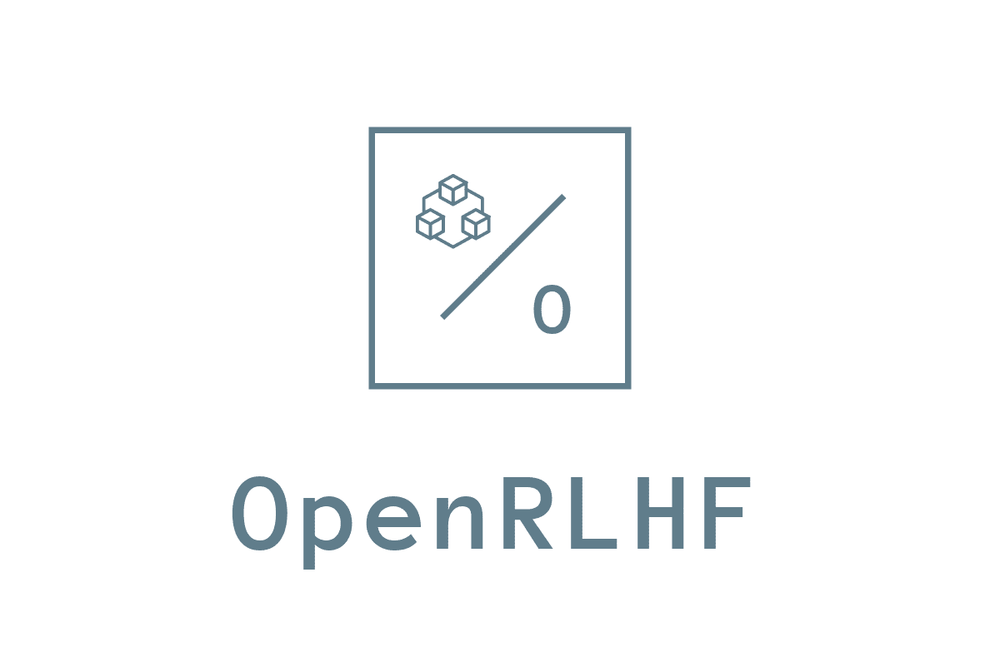

<div align="center">
<p align="center">

</p>
</div>

<div align="center">
<p align="center">
      <a href="https://github.com/OpenRLHF/OpenRLHF/graphs/contributors">
        
      </a>
      <a href="https://github.com/OpenRLHF/OpenRLHF/issues">
        
      </a>
      <a href="https://github.com/OpenRLHF/OpenRLHF/discussions">
        
      </a>
      <a href="https://github.com/OpenRLHF/OpenRLHF/pulls">
        
      <a href="https://github.com/OpenRLHF/OpenRLHF/stargazers">
        
      </a>
      <br>
      <em>开源 / 全面 / 轻量级 / 易用</em>
    </p>
</p>
</div>

<hr>

<span>[ <a href="README.md">English</a> | 中文 ]</span>

OpenRLHF 是一个基于 Ray、DeepSpeed 和 HF Transformers 构建的高性能 RLHF 框架：

- **简单易用**: OpenRLHF 是目前可用的最简单的高性能 RLHF 库之一，兼容 Huggingface 模型和数据集。
- **高性能**: RLHF 训练中 80% 的时间用于样本生成阶段。得益于使用 Ray 和 Adam Offload（固定内存）以及 vLLM 生成加速的能力，OpenRLHF 的性能是极致优化的 DeepSpeedChat with Hybrid Engine 的两倍以上。
- **分布式 RLHF**:  OpenRLHF 使用 Ray 将 Actor、Reward、Reference 和 Critic 模型分布到不同的 GPU 上，同时将 Adam 优化器放在 CPU 上。这使得使用多个 A100 80G GPU 和 vLLM 可以全面微调超过 70B+ 的模型 以及在多个 24GB RTX 4090 GPU 上微调 7B 模型。
- **PPO 实现技巧**: 我们集成了 PPO 的实现技巧以提高训练稳定性，详情参考 [知乎](https://zhuanlan.zhihu.com/p/622134699) 和 [Notion blog](https://difficult-link-dd7.notion.site/eb7b2d1891f44b3a84e7396d19d39e6f?v=01bcb084210149488d730064cbabc99f).

更多细节请参考 [技术报告](https://arxiv.org/abs/2405.11143) | [使用文档](https://openrlhf.readthedocs.io/)


## 特性

- 基于 Ray 的分布式 [PPO based on Ray](./examples/scripts/train_ppo_llama_ray.sh). 
- 支持使用 [超过 70 亿参数的模型进行全面 RLHF 微调](./examples/scripts/train_ppo_llama_ray_70b.sh).
- 支持 vLLM 生成加速在 RLHF 中 (--vllm_num_engines).
- 支持 多个奖励模型 (--reward_pretrain model1,model2...) 及 远程奖励模型 (--remote_rm_url).
- 支持 [DPO (直接偏好优化)/IPO/cDPO](./examples/scripts/train_dpo_llama.sh).
- 支持 [Kahneman-Tversky 优化 (KTO)](./examples/scripts/train_kto_llama.sh).
- 支持 [拒绝采样](./examples/scripts/train_rejection_sampling_llama.sh).
- 支持 [Iterative DPO](./examples/scripts/train_iterative_dpo_llama.sh) (https://github.com/RLHFlow/Online-RLHF).
- 支持 [条件 SFT](./examples/scripts/train_conditional_llama.sh) (https://arxiv.org/abs/2308.12050).
- 支持 [知识蒸馏](./examples/scripts/train_knowledge_distillation.sh) (https://github.com/microsoft/LMOps/tree/main/minillm).
- 支持 SFT/DPO/RM 训练样本打包 (--packing_samples).
- 支持 [MoE](./examples/test_scripts/train_sft_mixtral_lora.sh) (--aux_loss_coef)
- 支持 FlashAttention2 (--flash_attn).
- 支持 QLoRA (--load_in_4bit), [LoRA (--lora_rank, --target_modules)]((./examples/scripts/train_sft_mixtral_lora.sh)).
- 支持 HuggingFace `tokenizer.apply_chat_template` 用于数据集处理 (--apply_chat_template 和 --input_key).
- 支持 Wandb 日志 (--wandb).
- 支持 checkpoint 断点训练 (--load_checkpoint 和 --save_steps).
- 多节点 [训练脚本](./examples/scripts/train_llama_slurm.sh) 适用于 Slurm.


### PPO 支持矩阵

| 特性 | OpenRLHF | DSChat | CAIChat | TRL |
| ------------- |:-------------:| :-------------:| :-------------:| :-------------:| 
| 使用 16 个 A100 完成 70B+ 全微调      | ✅ | ❌ | ❌ | ❌ ||
| 使用 4 个 RTX4090 完成 7B 全微调 | ✅      |    ❌ | ❌ | ❌ | 
| 使用 8 个 A100 完成 34B DPO 全微调 | ✅      |    ❌ | ❌ | ❌ |   
| 支持推理引擎加速 | ✅      |    ✅ | ❌ | ❌ |  
| PPO 实现技巧 | ✅      |    ❌ | ❌ | ✅ | 
| 支持 QLoRA | ✅      |    ❌ | ❌ | ✅ | 
| 支持 Mixtral 8*7b | ✅      |    ❌ | ❌ | ❌ | 
| 支持未合并的 Actor-Critic | ✅     |   ✅ | ✅ | ❌ | 
| 支持多个奖励模型 | ✅      |    ❌ | ❌ | ❌ |   
| 支持 Huggingface 模型 | ✅      |    ✅ | ✅ | ✅ | 
| 易于使用 | ✅      |   ❌ (HybridEngine bugs) | ✅ | ✅ | 

## 快速开始

### 安装

要使用 OpenRLHF，首先启动 Docker 容器（**推荐**）然后执行 `pip install` 安装 `openrlhf`：

```bash
# 启动 docker container
docker run --runtime=nvidia -it --rm --shm-size="10g" --cap-add=SYS_ADMIN -v $PWD:/openrlhf nvcr.io/nvidia/pytorch:24.02-py3 bash
sudo pip uninstall xgboost transformer_engine flash_attn -y

# pip install
pip install openrlhf

# 如果你需要使用 vLLM 加速 (安装 vLLM 0.4.2)
pip install openrlhf[vllm]
# 最新的 vLLM 也是支持的 (支持 Gloo 权重传输)
pip install openrlhf[vllm_latest]

# pip install GitHub 上的最新版
pip install git+https://github.com/OpenRLHF/OpenRLHF.git

# 或者 git clone
git clone https://github.com/OpenRLHF/OpenRLHF.git
cd OpenRLHF
pip install -e .
```

> [!NOTE]
>我们推荐使用 vLLM 0.4.2，因为 0.4.3+ 版本目前仅支持通过 Gloo 进行权重同步（DeepSpeed to vLLM）（`--vllm_sync_backend gloo`）。
>我们也提供了 [Dockerfiles for vLLM](./dockerfile/) 和 [Nvidia-Docker 一键安装脚本](./examples/scripts/nvidia_docker_install.sh)。

### 准备数据集
OpenRLHF 在其数据集类中提供了多种数据处理方法。
例如在 [Prompt Dataset](https://github.com/OpenRLHF/OpenRLHF/blob/main/openrlhf/datasets/prompts_dataset.py#L6) 中：

```python
def preprocess_data(data, input_template=None, input_key="input", apply_chat_template=None) -> str:
    if apply_chat_template:
        prompt = apply_chat_template(data[input_key], tokenize=False, add_generation_prompt=True)
    else:
        prompt = data[input_key]
        if input_template:
            prompt = input_template.format(prompt)
    return prompt
```

- 我们可以使用 `--input_key` 指定 `JSON key name` 为输入数据集 `--prompt_data {name or path}` (PPO) 或 `--dataset {name or path}`，并使用 `--apply_chat_template` 利用 [Huggingface Tokenizer](https://huggingface.co/docs/transformers/main/en/chat_templating) 中的 `chat_template`。
- 如果不想使用 `--apply_chat_template`，可以改用 `--input_template`，或预先离线处理数据集。
- OpenRLHF 还支持使用 `--prompt_data_probs 0.1,0.4,0.5` (PPO) 或 `--dataset_probs 0.1,0.4,0.5` 混合多个数据集。

Chat Templating 的工作原理如下:

```python
dataset = [{"input_key": [
  {"role": "user", "content": "Hello, how are you?"},
  {"role": "assistant", "content": "I'm doing great. How can I help you today?"},
  {"role": "user", "content": "I'd like to show off how chat templating works!"},
]}]

tokenizer.apply_chat_template(dataset[0]["input_key"], tokenize=False)

"<s>[INST] Hello, how are you? [/INST]I'm doing great. How can I help you today?</s> [INST] I'd like to show off how chat templating works! [/INST]"
```

如何指定训练和测试数据分区 ?

你可以使用 `data_type@data_dir` 的方式指定, 比如下面的数据集可以设置为 `--dataset json@./data`

```
data
├── test.jsonl
└── train.jsonl
```

> [!NOTE]
>默认情况下我们使用 `train` 和 `test` 作为 split 区分 Huggingface 的训练/测试数据。
>`JSON key` 选项取决于具体的数据集。请参阅 [Reward Dataset](https://github.com/OpenRLHF/OpenRLHF/blob/main/openrlhf/datasets/reward_dataset.py#L10) 和 [SFT Dataset](https://github.com/OpenRLHF/OpenRLHF/blob/mai


### Supervised Fine-tuning

OpenRLHF 的模型检查点完全兼容 HuggingFace 模型。您可以使用 `--pretrain  {name or path}`、`--reward_pretrain  {name or path}` 和 `--critic_pretrain  {name or path}` 指定模型名称或路径。我们在 [HuggingFace OpenRLHF](https://huggingface.co/OpenRLHF) 上提供了一些预训练的检查点和数据集。

然后您可以使用我们在 [examples/scripts](./examples/scripts/) 目录中提供的启动脚本，或者使用以下命令启动训练：

```bash 
deepspeed --module openrlhf.cli.train_sft \
   --max_len 4096 \
   --dataset Open-Orca/OpenOrca \
   --input_key question \
   --output_key response \
   --input_template 'User: {}\nAssistant: ' \
   --train_batch_size 256 \
   --micro_train_batch_size 2 \
   --max_samples 500000 \
   --pretrain meta-llama/Meta-Llama-3-8B \
   --save_path ./checkpoint/llama3-8b-sft \
   --save_steps -1 \
   --logging_steps 1 \
   --eval_steps -1 \
   --zero_stage 2 \
   --max_epochs 1 \
   --bf16 \
   --flash_attn \
   --learning_rate 5e-6 \
   --gradient_checkpointing \
   --load_checkpoint \
   --use_wandb {wandb_token}

# 支持 HF tokenizer.apply_chat_template
# --apply_chat_template 
# --input_key {JSON Key}
# --tokenizer_chat_template {HF Chat Template}

# 支持 SFT 样本 packing
# --packing_samples

# 也可用于 continued pre-training
# --pretrain_mode
```

> [!NOTE]
> OpenRLHF SFT/DPO/RewardModel 训练支持 `--packing_samples` [基于 `--flash_attn`](https://github.com/MeetKai/functionary/tree/main/functionary/train/packing)

### Reward Model Training
```bash
deepspeed --module openrlhf.cli.train_rm \
   --save_path ./checkpoint/llama3-8b-rm \
   --save_steps -1 \
   --logging_steps 1 \
   --eval_steps -1 \
   --train_batch_size 256 \
   --micro_train_batch_size 1 \
   --pretrain OpenRLHF/Llama-3-8b-sft-mixture \
   --bf16 \
   --max_epochs 1 \
   --max_len 8192 \
   --zero_stage 3 \
   --learning_rate 9e-6 \
   --dataset OpenRLHF/preference_dataset_mixture2_and_safe_pku \
   --apply_chat_template \
   --chosen_key chosen \
   --rejected_key rejected \
   --flash_attn \
   --gradient_checkpointing \
   --load_checkpoint \
   --use_wandb {wandb_token}

# 支持样本 packing
# --packing_samples
```

### 不使用 Ray 的 PPO

```bash
deepspeed --module openrlhf.cli.train_ppo \
  --pretrain OpenRLHF/Llama-3-8b-sft-mixture \
  --reward_pretrain OpenRLHF/Llama-3-8b-rm-mixture \
  --save_path ./checkpoint/llama-3-8b-rlhf \
  --save_steps -1 \
  --logging_steps 1 \
  --eval_steps -1 \
  --micro_train_batch_size 2 \
  --train_batch_size 128 \
  --micro_rollout_batch_size 4 \
  --rollout_batch_size 1024 \
  --max_epochs 1 \
  --prompt_max_len 1024 \
  --generate_max_len 1024 \
  --zero_stage 2 \
  --bf16 \
  --actor_learning_rate 5e-7 \
  --critic_learning_rate 9e-6 \
  --init_kl_coef 0.01 \
  --prompt_data OpenRLHF/prompt-collection-v0.1 \
  --input_key context_messages \
  --apply_chat_template \
  --max_samples 100000 \
  --normalize_reward \
  --adam_offload \
  --flash_attn \
  --gradient_checkpointing \
  --load_checkpoint \
  --use_wandb {wandb_token}

# 支持远程 reward model (HTTP)
# --remote_rm_url http://localhost:5000/get_reward
```

### 使用 Ray 和 vLLM 的 PPO

为了提高 RLHF 训练速度或支持 70B 模型，我们可以使用 Ray 和 vLLM 加速的 PPO

```bash
# 在容器中启动 Ray 的主节点
ray start --head --node-ip-address 0.0.0.0 --num-gpus 8

# 如果要在更多节点上启动 Ray，请使用
ray start --address {MASTER-NODE-ADDRESS}:6379 --num-gpus 8

ray job submit --address="http://127.0.0.1:8265" \
  --runtime-env-json='{"working_dir": "/openrlhf"}' \
  -- python3 -m openrlhf.cli.train_ppo_ray \
  --ref_num_nodes 1 \
  --ref_num_gpus_per_node 2 \
  --reward_num_nodes 1 \
  --reward_num_gpus_per_node 2 \
  --critic_num_nodes 1 \
  --critic_num_gpus_per_node 2 \
  --actor_num_nodes 1 \
  --actor_num_gpus_per_node 2 \
  --vllm_num_engines 2 \
  --vllm_tensor_parallel_size 2 \
  --colocate_critic_reward \
  --colocate_actor_ref \
  --pretrain OpenRLHF/Llama-3-8b-sft-mixture \
  --reward_pretrain OpenRLHF/Llama-3-8b-rm-mixture \
  --save_path /openrlhf/examples/checkpoint/llama3-8b-rlhf \
  --micro_train_batch_size 8 \
  --train_batch_size 128 \
  --micro_rollout_batch_size 16 \
  --rollout_batch_size 1024 \
  --max_samples 100000 \
  --max_epochs 1 \
  --prompt_max_len 1024 \
  --generate_max_len 1024 \
  --zero_stage 3 \
  --bf16 \
  --actor_learning_rate 5e-7 \
  --critic_learning_rate 9e-6 \
  --init_kl_coef 0.01 \
  --prompt_data OpenRLHF/prompt-collection-v0.1 \
  --input_key context_messages \
  --apply_chat_template \
  --normalize_reward \
  --adam_offload \
  --flash_attn \
  --gradient_checkpointing \
  --load_checkpoint \
  --use_wandb {wandb_token}

# 支持远程 reward model (HTTP)
# --remote_rm_url http://localhost:5000/get_reward
```

> [!NOTE]
> 不设置 `--vllm_num_engines` 则是不使用 vLLM engine。
> 您也可以通过 ``setup_commands`` 让 Ray 自动初始化环境, 比如 `--runtime-env-json='{"setup_commands": ["pip install openrlhf[vllm]"]}'`

所有支持算法的启动脚本和文档在 [example/scripts](./examples/scripts/) 和 [Documents - Usage](https://openrlhf.readthedocs.io/en/latest/usage.html)


## 性能
我们通过启用Adam卸载、奖励模型(RM)和参考模型(Ref)卸载等技术,尽可能优化了DSChat的性能,从而在推理阶段增加小批量大小并避免内存不足问题。我们甚至修复了DSChat中的一些bug,以启用LLaMA2的混合引擎(HE)。使用优化后的DSChat和OpenRLHF训练1024个提示需要1个PPO轮次的平均时间(秒)如下:

| **Size** | **NVIDIA A800 GPUs** | **Optimized DSChat (with  Hybrid Engine)** | **OpenRLHF** | **Speedup** |
| :---: | :---: | :---: | :---: | :---: |
| 7B | 16 | 855.09 | 471.11 | 1.82x |
| 13B | 32 | 1528.93 | 608.93 | 2.5x |
| 34B | 32 | 3634.98 | 1526.4 | 2.4x |
| 70B | 32 | 10407.0 | 4488.53 | 2.3x |

## 调优指南
为了获得最佳的性能，我们建议您分配更多的节点给 vLLM Engine。例如，对于 70B 模型以及 32 张 A100，建议分配 16 张以上 A100 给 vLLM Engine，8 张给 Actor 模型，以及最后 8 张给 Critic 模型，同时开启 `--colocate_critic_reward`, `--colocate_actor_ref` 和 `--ref_reward_offload` 选项合并部分节点。最后您应该尽可能增大 `--rollout_micro_batch_size` ，以及减小 vLLM 的 TP 切分数量，同时避免 Reward/Reference 模型 forward 时内存不足。训练阶段的 `micro_train_batch_size` 也是越大越好。为 vLLM 开启 `enable_prefix_caching` 当 `n_samples_per_prompt > 1`.

## 使用 OpenRLHF 的公司和组织

- ByteDance
- NexusFlow
- Baidu
- Jülich Supercomputing Centre (JSC)
- Berkeley Starling Team
- Tencent
- Alibaba
- ...


## 加入我们

**如何加入？**

1. 通过联系邮箱 janhu9527@gmail.com 或者加入 [GitHub Organization](https://github.com/OpenRLHF)。请包含以下信息：
   - 您的姓名
   - 您的 GitHub 用户名
   - 您感兴趣的领域
   - 您在 NLP 和/或 AI 相关的技能和经验
2. 您也可以通过官方 GitHub [OpenRLHF ↗](https://github.com/OpenRLHF/OpenRLHF) 项目页面加入我们。只需创建一个关于您想要贡献的兴趣的 issue，我们会与您联系。

**您能做什么？**

1. 加入团队，参与 OpenRLHF 项目的开发。
2. 通过提交 pull 请求来为项目做出贡献。
3. 帮助改进文档，修复 bugs 或创建新功能。
4. 分享项目并帮助我们发展社区。

## 赞助我们

您的赞助可以帮助我们维护和改进 OpenRLHF。如果您觉得这个项目有用，请考虑赞助我们。您可以在 [Open Collective ↗](https://opencollective.com/OpenRLHF) 上赞助我们。

## 星图

[](https://star-history.com/#OpenRLHF/OpenRLHF&Date)

## 贡献者

非常感谢所有的贡献者！如果您想贡献，请随时创建 pull 请求或创建 issue。

<a href="https://github.com/OpenRLHF/OpenRLHF/graphs/contributors">
  
</a>

## 引用与致谢

我们想要对以下项目和组织在 AI 和 NLP 领域的贡献表示感谢：

- [Hugging Face Transformers ↗](https://github.com/huggingface/transformers)
- [OpenAI GPT ↗](https://github.com/openai/gpt-3)
- [LLaMA ↗](https://llama.meta.com/)
- [DeepSpeed ↗](https://github.com/microsoft/DeepSpeed)
- [Ray ↗](https://github.com/ray-project/ray)

我们的项目还想要感谢 [ColossalChat](https://github.com/hpcaitech/ColossalAI/tree/main/applications/Chat) 和 [DeepSpeedChat](https://github.com/microsoft/DeepSpeedExamples/tree/master/applications/DeepSpeed-Chat)。在项目的早期阶段，我们参考了他们的代码设计。

(2024/7) 我们的 GitHub 组织从 OpenLLMAI 迁移到了 OpenRLHF.

## 引用
```
@article{hu2024openrlhf,
  title={OpenRLHF: An Easy-to-use, Scalable and High-performance RLHF Framework},
  author={Jian Hu and Xibin Wu and Weixun Wang and Xianyu and Dehao Zhang and Yu Cao},
  journal={arXiv preprint arXiv:2405.11143},
  year={2024}
}
```


______________________________________________________________________

*OpenRLHF © 2024 OpenRLHF. 版权所有。*
