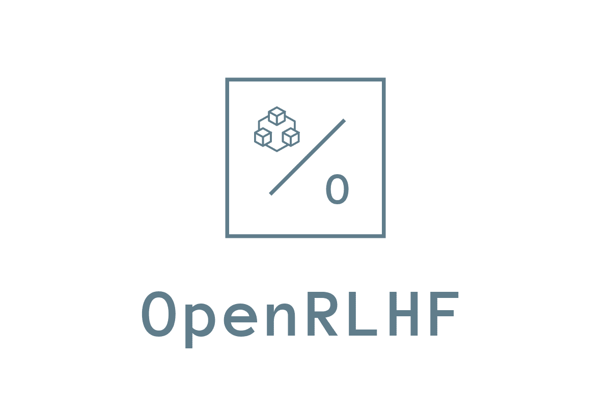
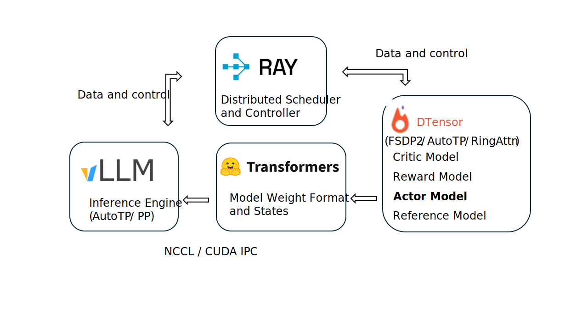

<div align="center">
    
</div>
<div align="center">
<p align="center">
      <a href="https://github.com/OpenRLHF/OpenRLHF/graphs/contributors">
        
      </a>
      <a href="https://github.com/OpenRLHF/OpenRLHF/issues">
        
      </a>
      <a href="https://github.com/OpenRLHF/OpenRLHF/discussions">
        
      </a>
      <a href="https://github.com/OpenRLHF/OpenRLHF/pulls">
        
      </a>
      <a href="https://github.com/OpenRLHF/OpenRLHF/stargazers">
        
      </a>
      <a href="https://deepwiki.com/OpenRLHF/OpenRLHF"></a>
      <br>
      <em>开源 / 全面 / 轻量级 / 易用</em>
    </p>
</div>

<hr>

<span>[ <a href="README.md">English</a> | 中文 | <a href="README_ja.md">日本語</a> ]</span>

OpenRLHF 是**首个**结合 **Ray + vLLM 分布式架构**与**统一 Agent 设计范式**的高性能、生产就绪的开源 RLHF 框架，用于可扩展和可扩展的人类反馈强化学习。

📚 **了解更多**：[文档](https://openrlhf.readthedocs.io/) | [PPT](https://docs.google.com/presentation/d/1JRhB1d7csofx0PIZBmfyBdMluxNd5JLPpUHrrvVhGnk/edit?usp=sharing) | [技术报告](https://www.researchgate.net/publication/393414548_OpenRLHF_An_Easy-to-use_Scalable_and_High-performance_RLHF_Framework) | [视频](https://www.bilibili.com/video/BV1dv2jBxEQG/)

## 📖 目录

- [🗞️ 新闻](#新闻)
- [🏗️ 架构基础](#架构基础ray--vllm-分布式) - Ray + vLLM + FSDP2 分布式基础设施
- [🎯 设计范式](#设计范式基于-agent-的执行) - 统一的 Agent 执行流程
- [🚀 RL 算法](#最先进的-rl-算法) - PPO、REINFORCE++、GRPO、RLOO
- [📋 特性概览](#全面特性) - 完整的 RLHF 流程能力
- [🎬 快速开始](#快速开始) - 安装和典型工作流
- [🎓 训练指南](#监督微调) - SFT、奖励模型、RL 训练
- [🎯 单轮 Agent](#单轮-agent强化微调与自定义奖励) - 自定义奖励函数
- [🤖 多轮 Agent](#多轮-agent复杂环境交互) - 复杂环境
- [🔧 高级主题](#高级主题) - LoRA、性能调优

---

<a id="新闻"></a>
## 新闻

<details>
<summary>展开新闻</summary>

- [2026/2] [ProRL V2](https://developer.nvidia.com/blog/scaling-llm-reinforcement-learning-with-prolonged-training-using-prorl-v2/) 使用 REINFORCE++-baseline 通过长期 RL 训练训练最先进的 1.5B 推理模型。训练脚本：[train_prorlv2_math_hybrid_engine.sh](./examples/scripts/train_prorlv2_math_hybrid_engine.sh)
- [2025/10] [ScaleRL](https://arxiv.org/abs/2510.13786) 验证了 REINFORCE++-baseline 在大规模训练场景中的有效性。发布 [REINFORCE++ PPT](https://docs.google.com/presentation/d/1stieP_3PM1z4Hq1YWR3GywFkxcHEAlstXMaS23KlGN4)
- [2025/6] [Magistral](https://mistral.ai/static/research/magistral.pdf) 使用与 REINFORCE++-baseline 非常相似的方法训练推理模型。
- [2025/5] [MARTI](https://github.com/TsinghuaC3I/MARTI) 作为 OpenRLHF 的分支发布。它旨在通过集成中心化多智能体交互与分布式策略训练来训练基于 LLM 的多智能体系统。
- [2025/5] OpenRLHF 0.8.0 支持通过 `--async_train` 启用异步 RLHF 训练，并通过 `--agent_func_path` 启用异步 Agent RLHF。可运行示例见 [train_reinforce_baseline_ray_agent_async.sh](./examples/scripts/train_reinforce_baseline_ray_agent_async.sh)。
- [2025/4] 发布博客 [Accelerating RLHF with vLLM, Best Practice from OpenRLHF](https://blog.vllm.ai/2025/04/23/openrlhf-vllm.html)
- [2025/4] Clean OpenRLHF：基于单控制器和统一打包样本重构了源代码
- [2025/3] CMU [高级自然语言处理 2025 春季](https://cmu-l3.github.io/anlp-spring2025/)课程使用 OpenRLHF 作为 RLHF 框架教学案例。
- [2025/2] [Logic-RL](https://arxiv.org/abs/2502.14768) 和 [PRIME](https://arxiv.org/abs/2502.01456) 证明 REINFORCE++ 相比 GRPO 更稳定，比 PPO 更快。
- [2025/2] [LMM-R1](https://github.com/TideDra/lmm-r1) 是 OpenRLHF 的分支，旨在为多模态任务上的 DeepSeek-R1 复现提供高性能 RL 基础设施。
- [2025/2] MIT 和微软使用 OpenRLHF 提出 [On the Emergence of Thinking in LLMs I: Searching for the Right Intuition](https://arxiv.org/pdf/2502.06773)
- [2025/1] HKUST 使用 OpenRLHF 复现了[小模型上的 DeepSeek-R1-Zero 和 DeepSeek-R1 训练](https://github.com/hkust-nlp/simpleRL-reason)
- [2024/12] 我们"提出"了😊 [REINFORCE++: A Simple and Efficient Approach for Aligning Large Language Models](https://www.researchgate.net/publication/387487679_REINFORCE_An_Efficient_RLHF_Algorithm_with_Robustnessto_Both_Prompt_and_Reward_Models)。
- [2024/12] 我们在 [Notion 博文](https://hijkzzz.notion.site/unraveling-rlhf-and-its-variants-engineering-insights#147d9a33ecc9806090f3d5c749d31f05)中分析了 PPO、REINFORCE++、GRPO 和 RLOO。
- [2023/8] OpenRLHF 开源。

</details>

---

<a id="架构基础ray--vllm-分布式"></a>
## 🏗️ 架构基础：Ray + vLLM 分布式

OpenRLHF 是**首个**基于 Ray + vLLM 分布式架构构建的 RLHF 框架，可高效地跨 GPU 编排多个组件：

<div align="center">
  
</div>

### 核心基础设施组件

**Ray - 分布式调度器和控制器**  
OpenRLHF 利用 [Ray](https://github.com/ray-project/ray) 实现高效的分布式调度。它将 Actor、Reward、Reference 和 Critic 模型分布到不同的 GPU 上，支持训练高达 **70B+ 参数**的模型。

**混合引擎调度**：所有模型和 vLLM 引擎可以共享 GPU 资源，最大限度地减少空闲时间并提高 GPU 利用率。这允许在有限的硬件上运行完整的 RLHF 流程。

**vLLM - 高性能推理引擎**  
RLHF 训练中 **80% 的时间**花在样本生成上。通过 [vLLM](https://github.com/vllm-project/vllm) 与自动张量并行（AutoTP）和流水线并行（PP），OpenRLHF 提供高吞吐量、内存高效的生成。

**FSDP2 - 内存高效训练**  
基于 PyTorch FSDP2（可组合的 `fully_shard`）、DTensor 张量并行，以及 RingAttention（上下文并行）。支持混合精度、（可选）CPU offload、分布式 checkpoint，并可直接与 HuggingFace 模型配合使用。

**Transformers - 模型接口**  
与 HuggingFace Transformers 原生集成，可无缝加载模型、状态管理和微调预训练模型。

**NCCL / CUDA IPC - 高速通信**  
高效的 GPU 间通信，用于分布式训练和推理。

---

<a id="设计范式基于-agent-的执行"></a>
## 🎯 设计范式：基于 Agent 的执行

**在 Ray 分布式架构之上**，OpenRLHF 是**首个**实现**统一 Agent 范式**的 RLHF 框架。无论是标准 PPO 还是复杂的多轮推理，每次训练运行都遵循一致的 Agent 执行流程。

### 为什么采用 Agent 范式？

OpenRLHF **通过 token-in-token-out 的 Agent 执行统一生成和训练**，确保完美一致性、轻松的单轮/多轮扩展，以及零文本级别不匹配。

### Agent 架构

```
                 ┌─────────────────────────────┐
                 │    AgentExecutorBase        │
                 │  (Token-in-Token-out 核心)  │
                 └─────────────────────────────┘
                              │
                 ┌────────────┴────────────┐
                 ↓                         ↓
         SingleTurnExecutor        MultiTurnExecutor
                 │                         │
      ┌──────────┴──────────┐   ┌─────────┴──────────┐
      ↓                     ↓   ↓                    ↓
  标准 RLHF          自定义奖励    多步推理        外部环境
  (单次生成)           函数                      (NeMo Gym)
      ↓                     ↓           ↓                ↓
      └─────────────────────┴───────────┴────────────────┘
                              │
                    一致的 Token 轨迹
                              │
                    ┌─────────┴─────────┐
                    │  RL 算法          │
                    │  (解耦)           │
                    │                   │
                    │  PPO, REINFORCE++ │
                    │  GRPO, RLOO 等    │
                    └───────────────────┘
```

### 核心设计原则

<details>
<summary>展开核心设计原则</summary>

| 原则 | 描述 | 优势 |
|------|------|------|
| **Token-in-Token-out** | 所有采样产生 token 级轨迹 | 零文本级不匹配 |
| **统一接口** | 所有模式使用相同的 `AgentExecutorBase` API | 一个标志切换模式 |
| **算法无关** | RL 算法（PPO、REINFORCE++ 等）与 Agent 执行器解耦 | 任何算法适用于任何模式 |
| **可扩展** | 轻松插入自定义奖励/环境 | 快速实验 |
| **生产就绪** | 支持同步/异步/混合引擎 | 从研究到部署 |

</details>

### 两种执行模式（与 RL 算法正交）

Agent 执行模式与您选择的 RL 算法**独立**。您可以将**任何算法**（PPO、REINFORCE++、GRPO 等）与**任何执行模式**配合使用：

| 模式 | 使用场景 | 接口 | 复杂度 |
|------|---------|------|--------|
| **单轮** | 标准 RLHF、自定义奖励函数 | 可选 `reward_func()` | ⭐ 默认（99% 用例）|
| **多轮** | 多步推理、交互式环境 | `reset()` + `step()` | ⭐⭐ 高级 |

---

<a id="最先进的-rl-算法"></a>
## 🚀 最先进的 RL 算法

OpenRLHF 实现了 **PPO、REINFORCE++、REINFORCE++-baseline、GRPO、RLOO**，采用受实践指南和社区最佳实践启发的高级优化技巧。

**关键设计**：RL 算法与 Agent 执行模式**解耦**。所有算法都可以与单轮和多轮 Agent 执行器无缝配合，通过统一的 token-in-token-out 流程运行，确保行为一致。

<details>
<summary>展开算法对比表</summary>

| 算法 | `--advantage_estimator` | 关键特性 | 最佳用例 |
|------|-------------------------|---------|---------|
| **PPO** | (默认) | 完整 critic 网络 | 稳定训练，成熟结果 |
| **REINFORCE++** | `reinforce` | 无 critic 的 PPO 技巧 | 高效训练，更少内存 |
| **REINFORCE++-baseline** | `reinforce_baseline` | 均值奖励基线 | 推理任务（RLVR），对奖励尺度鲁棒 |
| **RLOO** | `rloo` | Per-token KL + PPO-clip | 多样本训练 |
| **GRPO** | `group_norm` | 组归一化 | 基于批次的训练 |
| **Dr. GRPO** | `dr_grpo` | 简化的 GRPO | 移除局部 `/std` 归一化 |

</details>

参考：[知乎文章](https://zhuanlan.zhihu.com/p/622134699) | [Notion 最佳实践](https://hijkzzz.notion.site/rlhf-implementation-tricks?v=158d9a33ecc98132bf9e000c39227361)

---
 

<a id="全面特性"></a>
## 📋 全面特性

OpenRLHF 提供完整的 RLHF 流程，具有基于 Agent 的灵活性：

### 🎯 基于 Agent 的 RL 训练（核心创新）

<details>
<summary>展开基于 Agent 的 RL 训练细节</summary>

**单轮模式**（默认 - 99% 的用例）
- 每个提示单次生成
- 适用于所有 RL 算法：[PPO](./examples/scripts/train_ppo_ray_hybrid_engine.sh)、[REINFORCE++/baseline/GRPO/RLOO](./examples/scripts/train_reinforce_baseline_hybrid_engine.sh)
- [自定义奖励函数](./examples/scripts/train_ppo_with_reward_fn.sh)（`--remote_rm_url`）
- [混合引擎](./examples/scripts/train_ppo_ray_hybrid_engine.sh)以最大化 GPU 利用率

**多轮模式**（高级 - 交互式任务）
- 与环境反馈的多步交互
- 适用于所有 RL 算法
- [自定义 Agent 函数](./examples/scripts/train_reinforce_baseline_ray_agent_async.sh)（`--agent_func_path`）
- NeMo Gym 集成：参见 `examples/python/agent_func_nemogym_executor.py`（集成 NeMo Gym rollout 的 agent executor 示例）
- 异步流水线（`--async_train`）提高吞吐量：[train_reinforce_baseline_ray_agent_async.sh](./examples/scripts/train_reinforce_baseline_ray_agent_async.sh)

</details>

### 🎓 监督训练和偏好学习

<details>
<summary>展开监督训练与偏好学习表</summary>

| 方法 | 脚本 | 描述 |
|------|------|------|
| **SFT** | [train_sft.sh](./examples/scripts/train_sft.sh) | 带打包的监督微调 |
| **DPO/IPO/cDPO** | [train_dpo_llama.sh](./examples/scripts/train_dpo_llama.sh) | 直接偏好优化 |
| **KTO** | [train_kto_llama.sh](./examples/scripts/train_kto_llama.sh) | Kahneman-Tversky 优化 |
| **迭代 DPO** | [train_iterative_dpo.sh](./examples/scripts/train_iterative_dpo.sh) | 在线偏好学习 |
| **奖励模型** | [train_rm.sh](./examples/scripts/train_rm.sh) | 训练奖励模型 |
| **过程奖励模型** | [train_prm_mistral.sh](./examples/scripts/train_prm_mistral.sh) | 逐步奖励模型 |
| **拒绝采样** | [train_rejection_sampling_llama.sh](./examples/scripts/train_rejection_sampling_llama.sh) | Best-of-N 采样 |
| **条件 SFT** | [train_conditional.sh](./examples/scripts/train_conditional.sh) | 质量条件训练 |
| **蒸馏** | [train_knowledge_distillation.sh](./examples/scripts/train_knowledge_distillation.sh) | 知识迁移 |

</details>

### ⚡ 高级能力

<details>
<summary>展开高级能力</summary>

**效率优化**
- 所有训练模式的样本打包（`--packing_samples`）
- 快速生成的 vLLM 加速（`--vllm_num_engines`）
- DAPO [动态过滤](./examples/scripts/train_dapo_ray_hybrid_engine.sh)（`--dynamic_filtering`）
  - 🎲 Dynamic Sampling：对每个 prompt 生成多条响应，并根据奖励函数/Agent 返回的 **0–1 `scores`** 信号进行过滤
    - 开启：`--dynamic_filtering`
    - 设置分数范围：`--dynamic_filtering_reward_range 0.0 1.0`
    - 前置条件：`--n_samples_per_prompt > 1`，并提供 `--remote_rm_url`（奖励函数）或 `--agent_func_path`（Agent）
    - 示例：`./examples/scripts/train_dapo_ray_hybrid_engine.sh`

**可扩展性**
- FSDP2 张量并行（参见训练脚本中的 `--fsdp2_tp_size`）
- 长上下文的 [RingAttention](./examples/test_scripts/train_dpo_ring_llama.sh)（`--fsdp2_cp_size`）
- 使用 [SLURM](./examples/scripts/train_ppo_ray_slurm.sh) 的多节点训练

**模型支持**
- [LoRA](./examples/scripts/train_sft_mixtral_lora.sh)（`--lora_rank`）
- [专家混合（MoE）](./examples/test_scripts/train_sft_moe.sh)（`--aux_loss_coef`）
- FlashAttention（`--attn_implementation`）
- HuggingFace 聊天模板（`--apply_chat_template`）

**生产特性**
- Wandb（`--use_wandb`）和 TensorBoard（`--use_tensorboard`）日志
- 检查点恢复（`--load_checkpoint`、`--save_steps`）
- 评估数据集（`--eval_dataset`）

</details>

---

<a id="快速开始"></a>
## 🎬 快速开始

### 安装

**推荐**：使用 Docker 以实现无忧设置

```bash
# 1. 启动 Docker 容器
docker run --runtime=nvidia -it --rm --shm-size="10g" --cap-add=SYS_ADMIN \
  -v $PWD:/openrlhf nvcr.io/nvidia/pytorch:25.11-py3bash

# 2. 清理冲突包
sudo pip uninstall xgboost transformer_engine flash_attn pynvml -y

# 3. 安装 OpenRLHF（选择一个）
pip install openrlhf                    # 基础
pip install openrlhf[vllm]              # + vLLM 0.16.0（推荐）
pip install openrlhf[vllm_latest]       # + 最新 vLLM
pip install openrlhf[vllm,ring,liger]   # + 所有优化
```

**替代方案：从源码安装**

```bash
git clone https://github.com/OpenRLHF/OpenRLHF.git
cd OpenRLHF
pip install -e .
```

> [!TIP]
> 我们推荐 **vLLM 0.16.0+** 以获得最佳性能。参见 [Dockerfiles](./dockerfile/) 和 [Nvidia-Docker 安装脚本](./examples/scripts/nvidia_docker_install.sh)。

### 准备数据集

OpenRLHF 提供灵活的数据处理方法：

**关键参数**：
- `--input_key`：指定输入数据的 JSON 键名
- `--apply_chat_template`：使用 HuggingFace tokenizer 的[聊天模板](https://huggingface.co/docs/transformers/main/en/chat_templating)
- `--input_template`：自定义模板字符串（聊天模板的替代方案）
- `--prompt_data_probs` / `--dataset_probs`：混合多个数据集（例如 `0.1,0.4,0.5`）
- `--eval_dataset`：指定评估数据集路径

**聊天模板示例**：

```python
dataset = [{"input_key": [
  {"role": "user", "content": "Hello, how are you?"},
  {"role": "assistant", "content": "I'm doing great. How can I help you today?"},
  {"role": "user", "content": "I'd like to show off how chat templating works!"},
]}]

tokenizer.apply_chat_template(dataset[0]["input_key"], tokenize=False)
# 输出: "<s>[INST] Hello, how are you? [/INST]I'm doing great...</s> [INST] I'd like to show off... [/INST]"
```

> [!NOTE]
> JSON 键选项因数据集类型而异。参见[奖励数据集](https://github.com/OpenRLHF/OpenRLHF/blob/main/openrlhf/datasets/reward_dataset.py#L10)、[SFT 数据集](https://github.com/OpenRLHF/OpenRLHF/blob/main/openrlhf/datasets/sft_dataset.py#L9)和[提示数据集](https://github.com/OpenRLHF/OpenRLHF/blob/main/openrlhf/datasets/prompts_dataset.py#L6)

<a id="监督微调"></a>
### 监督微调

OpenRLHF 的模型检查点与 HuggingFace 模型完全兼容。您可以使用 `--pretrain {name or path}`、`--reward_pretrain {name or path}` 和 `--critic_pretrain {name or path}` 指定模型名称或路径。我们在 [HuggingFace OpenRLHF](https://huggingface.co/OpenRLHF) 上提供了一些预训练检查点和数据集。

然后您可以使用我们在 [examples/scripts](./examples/scripts/) 目录中提供的启动脚本，或使用以下命令开始训练。

<details>
<summary>SFT 命令</summary>

```bash
torchrun --standalone --nproc-per-node 8 -m openrlhf.cli.train_sft \
   --max_len 4096 \
   --dataset Open-Orca/OpenOrca \
   --input_key question \
   --output_key response \
   --input_template $'User: {}\nAssistant: ' \
   --train_batch_size 256 \
   --micro_train_batch_size 2 \
   --max_samples 500000 \
   --pretrain meta-llama/Meta-Llama-3-8B \
   --save_path ./checkpoint/llama3-8b-sft \
   --save_steps -1 \
   --logging_steps 1 \
   --eval_steps -1 \
   --max_epochs 1 \
   --packing_samples \
   --param_dtype bf16 \
   --learning_rate 5e-6 \
   --gradient_checkpointing \
   --use_wandb {wandb_token}

# 附加选项：
# --apply_chat_template                # 使用 HF tokenizer 聊天模板
# --fsdp2_cp_size 2                    # 启用 RingAttention（先安装 ring_flash_attn）
# --multiturn                          # 多轮微调损失
# --pretrain_mode                      # 继续预训练模式
```

</details>

### 奖励模型训练

<details>
<summary>奖励模型训练命令</summary>

```bash
torchrun --standalone --nproc-per-node 8 -m openrlhf.cli.train_rm \
   --save_path ./checkpoint/llama3-8b-rm \
   --save_steps -1 \
   --logging_steps 1 \
   --eval_steps -1 \
   --train_batch_size 256 \
   --micro_train_batch_size 1 \
   --pretrain OpenRLHF/Llama-3-8b-sft-mixture \
   --param_dtype bf16 \
   --max_epochs 1 \
   --max_len 8192 \
   --learning_rate 9e-6 \
   --dataset OpenRLHF/preference_dataset_mixture2_and_safe_pku \
   --apply_chat_template \
   --chosen_key chosen \
   --rejected_key rejected \
   --packing_samples \
   --gradient_checkpointing \
   --use_wandb {wandb_token}
```

</details>

建议将奖励模型的 `--value_prefix_head` 选项设置为 `score`，以便我们可以使用 `AutoModelForSequenceClassification` 加载模型：

```python
reward_model = AutoModelForSequenceClassification.from_pretrained(
              reward_model_path,
              num_labels=1,
              torch_dtype=torch.bfloat16,
              attn_implementation="flash_attention_2",
              use_cache=False,
          )
inputs = xxxx (左填充输入 Tokens)
reward = reward_model.model(*inputs).last_hidden_state
reward = reward_model.score(reward)[:, -1]
```

### RL 训练：使用 Ray 和 vLLM 的 PPO/REINFORCE++

OpenRLHF 中的所有 RL 训练都通过 **Agent 执行流程**运行。以下示例展示了使用混合引擎的单轮 Agent 执行（默认模式）以获得最佳性能：

```bash
# 在容器中启动 ray 的主节点
ray start --head --node-ip-address 0.0.0.0 --num-gpus 8

# 如果要在更多节点上启动 ray，使用
ray start --address {MASTER-NODE-ADDRESS}:6379  --num-gpus 8

ray job submit --address="http://127.0.0.1:8265" \
   --runtime-env-json='{"working_dir": "/openrlhf"}' \
   -- python3 -m openrlhf.cli.train_ppo_ray \
   --ref_num_nodes 1 \
   --ref_num_gpus_per_node 8 \
   --reward_num_nodes 1 \
   --reward_num_gpus_per_node 8 \
   --critic_num_nodes 1 \
   --critic_num_gpus_per_node 8 \
   --actor_num_nodes 1 \
   --actor_num_gpus_per_node 8 \
   --vllm_num_engines 4 \
   --vllm_tensor_parallel_size 2 \
   --colocate_all_models \
   --vllm_gpu_memory_utilization 0.5 \
   --pretrain OpenRLHF/Llama-3-8b-sft-mixture \
   --reward_pretrain OpenRLHF/Llama-3-8b-rm-700k \
   --save_path /openrlhf/examples/test_scripts/final/llama3-8b-rlhf \
   --ckpt_path /openrlhf/examples/test_scripts/ckpt/llama3-8b-rlhf \
   --save_hf_ckpt \
   --train_batch_size 128 \
   --rollout_batch_size 1024 \
   --use_dynamic_batch \
   --n_samples_per_prompt 1 \
   --max_epochs 1 \
   --prompt_max_len 1024 \
   --max_samples 100000 \
   --generate_max_len 1024 \
   --param_dtype bf16 \
   --actor_learning_rate 5e-7 \
   --critic_learning_rate 9e-6 \
   --init_kl_coef 0.01 \
   --prompt_data OpenRLHF/prompt-collection-v0.1 \
   --input_key context_messages \
   --apply_chat_template \
   --normalize_reward \
   --gradient_checkpointing \
   --packing_samples \
   --vllm_sync_backend nccl \
   --enforce_eager \
   --vllm_enable_sleep \
   --fsdp2_enable_sleep \
   --use_wandb {wandb_token}

# 算法变体（所有算法都使用单轮 Agent 执行）：
# --advantage_estimator reinforce        # REINFORCE++
# --advantage_estimator rloo             # RLOO
# --advantage_estimator reinforce_baseline  # REINFORCE++-baseline（RLVR 最佳）
# --advantage_estimator group_norm       # GRPO
# --advantage_estimator dr_grpo          # Dr. GRPO

# 高级选项：
# --init_kl_coef 0                      # 无参考模型
# --remote_rm_url http://host:5000/get_reward  # HTTP 奖励模型
# --n_samples_per_prompt 4              # 每个提示多个样本
# --enable_vllm_is_correction           # TIS（vLLM 重要性采样修正）：用于 off-policy rollout（仅 PPO 生效）
# --vllm_is_truncated_threshold 0.5 5.0 # TIS 截断区间：[low, high]
# --use_icepop                          # ICEPOP：将区间外系数置 0（而不是 clamp）
```

> [!TIP]
> **对于推理任务（RLVR）**：使用 `--advantage_estimator reinforce_baseline` 用于 REINFORCE++-baseline——它对不同的奖励尺度具有鲁棒性。

> [!NOTE]
> **Ray 环境设置**：让 Ray 使用 `--runtime-env-json='{"setup_commands": ["pip install openrlhf[vllm]"]}'` 自动部署

> [!NOTE]
> **GPU 索引错误故障排除**：如果遇到 Ray GPU 设备设置问题，请设置 `export RAY_EXPERIMENTAL_NOSET_CUDA_VISIBLE_DEVICES=1`。

📚 **更多示例**：参见 [example/scripts](./examples/scripts/) 和[文档](https://openrlhf.readthedocs.io/en/latest/usage.html)

---

<a id="单轮-agent强化微调与自定义奖励"></a>
## 🎯 单轮 Agent：强化微调与自定义奖励

**单轮 Agent 执行**（默认模式）支持自定义奖励函数——非常适合无需训练奖励模型的强化微调。您可以提供一个 Python 函数来即时计算奖励，而不是使用预训练的奖励模型。

**适用于**：
- 基于规则的奖励（长度、格式、代码执行、数学验证）
- 外部 API 奖励（评判模型、编译器、测试套件）
- 混合奖励（组合多个信号）

### 示例：自定义奖励函数

```python
# reward_func.py
import torch

def reward_func(queries, prompts, labels):
    """
    计算生成响应的自定义奖励。
    
    参数：
        queries: List[str] - 完整文本（提示 + 响应）
        prompts: List[str] - 仅原始提示
        labels: List[str] - 真实标签（来自 --label_key）
    
    返回：
        包含以下内容的字典：
            - rewards: 用于优势计算的张量
            - scores: 用于动态过滤的张量（0-1 范围）
            - extra_logs: 用于 wandb 日志的字典
    """
    batch_size = len(queries)
    
    # 示例：随机奖励（替换为您的逻辑）
    # 真实示例：代码执行、数学验证、格式检查
    reward = torch.randint(0, 2, (batch_size,)).float()
    
    return {
        "rewards": reward,           # 用于 RL 优势计算
        "scores": reward,            # 用于动态过滤（--dynamic_filtering）
        "extra_logs": {              # 记录到 wandb
            "custom_metric": reward.mean().item(),
        },
    }
```

### 使用方法

```bash
ray job submit --address="http://127.0.0.1:8265" \
  --runtime-env-json='{"working_dir": "/openrlhf"}' \
  -- python3 -m openrlhf.cli.train_ppo_ray \
  --pretrain meta-llama/Meta-Llama-3-8B \
  --use_dynamic_batch \
  --remote_rm_url /path/to/reward_func.py \
  --label_key answer \
  --prompt_data your_prompt_dataset \
  ... # 其他训练参数
```

**关键参数**：`--label_key answer` 将数据集中的"answer"字段传递给 `reward_func` 作为 `labels`。

> [!TIP]
> **使用案例**：代码生成（执行测试）、数学（验证解决方案）、格式化（检查结构）、多目标（组合多个信号）

📖 **完整示例**：[examples/scripts/train_ppo_with_reward_fn.sh](./examples/scripts/train_ppo_with_reward_fn.sh)

---

<a id="多轮-agent复杂环境交互"></a>
## 🤖 多轮 Agent：复杂环境交互

对于需要**多步交互**（推理链、带反馈的编码、游戏）的任务，OpenRLHF 提供**多轮 Agent 执行**模式。

### 构建自定义多轮 Agent

使用 `reset/step` 方法实现 `AgentInstanceBase`：

```python
# agent_func.py
import random
from typing import Any, Dict

import torch
from openrlhf.utils.agent import AgentInstanceBase, MultiTurnAgentExecutor


# 一个简单的 n 步随机环境
class AgentInstance(AgentInstanceBase):
    async def __init__(self, *args, **kwargs):
        self.step_idx = 0
        self.max_steps = random.randint(1, 3)  # 1-3 步

    async def reset(self, states: dict, **kwargs):
        return {"observation": states["observation"]}  # 返回原始文本观察

    async def step(self, states: dict, **kwargs) -> Dict[str, Any]:
        print(f"step_idx: {self.step_idx}, max_steps: {self.max_steps}")

        observation_text = states["observation_text"]
        action_text = states["action_text"]
        label = states["label"]

        # 检查回合是否结束
        done = self.step_idx >= self.max_steps
        reward = torch.randint(0, 2, (1,)).float() if done else torch.tensor(0)

        # 根据回合是否结束生成环境反馈
        environment_feedback = (
            "\n\nHuman: [CORRECT]\n</s>"
            if done
            else "\n\nHuman: [INCORRECT]\nPlease analyze the issues and try again.\n</s>\n\nAssistant: "
        )

        self.step_idx += 1

        return {
            "rewards": reward,  # 用于优势计算的奖励
            "scores": reward,  # 用于动态过滤的分数（0-1 奖励）
            "environment_feedback": environment_feedback,  # 环境反馈文本
            "done": done,  # 指示回合是否完成的布尔值
            "sampling_params": states.get("sampling_params", None),  # 下一步 vLLM 采样参数
            "extra_logs": {"dummy_scores": reward},  # 额外的日志信息
        }


class AgentExecutor(MultiTurnAgentExecutor):
    def __init__(self):
        super().__init__(AgentInstance)
```

然后启动：

```bash
ray job submit --address="http://127.0.0.1:8265" \
  --runtime-env-json='{"working_dir": "/openrlhf"}' \
  -- python3 -m openrlhf.cli.train_ppo_ray \
  ...
  --use_dynamic_batch \
  --agent_func_path /path/to/agent_func.py \
  --async_train  # 可选：启用异步流水线
```

### 配置选项

**异步流水线**（提高吞吐量）：
- 启用：`--async_train`
- 缓冲区大小：`--async_queue_size 1`（越大 = 越多 off-policy，默认 1）

**训练模式**：
- **同步**：默认，更好的稳定性
- **异步**：更高吞吐量，可能影响收敛
- **混合引擎**：使用 `--colocate_all_models` 实现最佳 GPU 利用率（移除 `--async_train`）

> [!NOTE]
> 对于完全自定义的 token 级执行，继承 `AgentExecutorBase` 并实现 `execute()`。此设计强制执行 **token-in-token-out 原则**以保持采样和训练一致。

> [!WARNING] 
> 异步训练可能会影响训练稳定性。仅在吞吐量至关重要且收敛已验证时使用。

📚 **示例**：
- 单轮：[train_ppo_ray_hybrid_engine.sh](./examples/scripts/train_ppo_ray_hybrid_engine.sh)
- 自定义奖励：[train_ppo_with_reward_fn.sh](./examples/scripts/train_ppo_with_reward_fn.sh)
- 多轮：[train_reinforce_baseline_ray_agent_async.sh](./examples/scripts/train_reinforce_baseline_ray_agent_async.sh)
- NeMo Gym：`examples/python/agent_func_nemogym_executor.py`

---

<a id="高级主题"></a>
## 🔧 高级主题

### LoRA：合并适配器

使用 LoRA/QLoRA 时，OpenRLHF 仅保存适配器权重。要部署或继续训练，请将适配器与基础模型合并：

```bash
python -m openrlhf.cli.lora_combiner \
    --model_path meta-llama/Meta-Llama-3-8B \
    --lora_path ./checkpoint/llama3-8b-rm \
    --output_path ./checkpoint/llama-3-8b-rm-combined \
    --is_rm \
    --param_dtype bf16
```

或者，您可以通过 `--lora_path` 直接在推理时加载 LoRA 适配器，无需单独的合并步骤：

```bash
# 批量推理
python -m openrlhf.cli.batch_inference \
    --eval_task generate \
    --pretrain meta-llama/Meta-Llama-3-8B \
    --lora_path ./checkpoint/llama3-8b-sft-lora \
    --output_path ./output.jsonl \
    --dataset your_dataset \
    --max_new_tokens 2048

# 交互式对话
python -m openrlhf.cli.interactive_chat \
    --pretrain meta-llama/Meta-Llama-3-8B \
    --lora_path ./checkpoint/llama3-8b-sft-lora
```

### 性能调优指南

通过以下建议针对您的硬件和工作负载优化 OpenRLHF：

#### 🎯 资源分配（分布式模式）

**推荐比例**：`vLLM : Actor : Critic = 1:1:1`

```bash
# 示例：48 个 A100 GPU 上的 70B 模型
# - 16 个 GPU → vLLM 引擎
# - 16 个 GPU → Actor
# - 16 个 GPU → Critic
```

#### ⚡ 速度优化

| 优化 | 标志 | 何时使用 |
|------|------|---------|
| **混合引擎** | `--colocate_all_models`<br>`--vllm_enable_sleep`<br>`--fsdp2_enable_sleep` | GPU 内存充足 |
| **异步训练** | `--async_train` | 收敛已验证，需要吞吐量 |
| **样本打包** | `--packing_samples` | 始终（尤其是训练） |
| **动态批次** | `--use_dynamic_batch` | 可变序列长度 |
| **前缀缓存** | vLLM 配置 | `n_samples_per_prompt` > 1 |

#### 💾 内存管理

**当您有足够内存时**：
- ✅ 禁用 `--fsdp2_cpu_offload`
- ✅ 使用 `--colocate_critic_reward` 和 `--colocate_actor_ref`

**遇到 OOM 时**：
- ❌ 禁用所有 `--colocate_*` 选项
- ✅ 减少批次大小
- ✅ 启用梯度检查点
- ✅ 必要时启用 `--fsdp2_cpu_offload`

#### 🎮 批次大小调优

1. **生成阶段**：最大化 `--micro_rollout_batch_size`，最小化 vLLM TP 大小
2. **训练阶段**：最大化 `--micro_train_batch_size`，启用 `--packing_samples`
3. **vLLM**：始终使用 `--vllm_sync_backend nccl`

> [!TIP]
> **快速开始模板**：对于 8x A100（80GB），尝试混合引擎 + `--vllm_gpu_memory_utilization 0.5` + `--colocate_all_models`

📖 **更多详情**：[性能调优文档](https://openrlhf.readthedocs.io/en/latest/performance.html)

## 使用 OpenRLHF 的公司和组织

- Google
- ByteDance
- Tencent
- Alibaba
- Baidu
- China Telecom
- Vivo
- Allen AI
- NexusFlow
- Jülich Supercomputing Centre (JSC)
- Berkeley Starling Team
- M-A-P
- ...

## 加入我们

**如何加入？**

1. 发送电子邮件至 janhu9527@gmail.com 或加入 [GitHub Organization](https://github.com/OpenRLHF)。请包含以下详细信息：
   - 您的姓名
   - 您的 GitHub 用户名
   - 您感兴趣的领域
   - 您与 NLP 和/或 AI 相关的技能和经验
2. 您也可以通过官方 GitHub [OpenRLHF ↗](https://github.com/OpenRLHF/OpenRLHF) 项目页面加入我们。只需创建一个关于您贡献兴趣的 issue，我们会回复您。

**您可以做什么？**

1. 加入团队并参与 OpenRLHF 项目的开发。
2. 通过提交 pull request 为项目做出贡献。
3. 帮助改进文档、修复错误或创建新功能。
4. 分享项目并帮助我们发展社区。

## 赞助我们

您的赞助可以帮助我们维护和改进 OpenRLHF。如果您觉得这个项目有用，请考虑赞助我们。您可以在 [Open Collective ↗](https://opencollective.com/OpenRLHF) 上赞助我们。

## Star 历史

[](https://star-history.com/#OpenRLHF/OpenRLHF&Date)

## 贡献者

非常感谢所有贡献者！如果您想贡献，请随时提交 pull request 或创建 issue。

<a href="https://github.com/OpenRLHF/OpenRLHF/graphs/contributors">
  
</a>

## 参考文献与致谢

我们要感谢以下项目和组织对 AI 和 NLP 领域的贡献：

- [Hugging Face Transformers ↗](https://github.com/huggingface/transformers)
- [OpenAI GPT ↗](https://github.com/openai/gpt-3)
- [LLaMA ↗](https://llama.meta.com/)
- [DeepSpeed ↗](https://github.com/microsoft/DeepSpeed)
- [PyTorch ↗](https://github.com/pytorch/pytorch)
- [Ray ↗](https://github.com/ray-project/ray)

我们的项目还要感谢 [ColossalChat](https://github.com/hpcaitech/ColossalAI/tree/main/applications/ColossalChat) 和 [DeepSpeedChat](https://github.com/microsoft/DeepSpeedExamples/tree/master/applications/DeepSpeed-Chat)。在项目早期，我们参考了他们的代码设计。我们的项目要感谢 [Netmind.AI](https://www.netmind.ai/) 为开发 ring attention 提供的 GPU 支持。

（2024/7）我们的 GitHub 组织已从 OpenLLMAI 更改为 OpenRLHF。

## 引用

OpenRLHF
```
@article{hu2024openrlhf,
  title={OpenRLHF: An Easy-to-use, Scalable and High-performance RLHF Framework},
  author={Jian Hu and Xibin Wu and Zilin Zhu and Xianyu and Weixun Wang and Dehao Zhang and Yu Cao},
  journal={arXiv preprint arXiv:2405.11143},
  year={2024}
}
```

REINFORCE++-baseline
```
@article{hu2025reinforce++,
  title={Reinforce++: A simple and efficient approach for aligning large language models},
  author={Hu, Jian},
  journal={arXiv preprint arXiv:2501.03262},
  year={2025}
}
```

______________________________________________________________________

*OpenRLHF © 2025 OpenRLHF. All Rights Reserved.*
