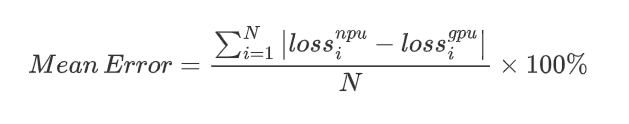

# OpenRLHF x Ascend

我们在 OpenRLHF 上增加对华为昇腾设备的支持，在华为昇腾设备上使用 OpenRLHF 与在英伟达 GPU 上使用几乎相同。

## 硬件支持

* Atlas 800T A2

## 安装

### 环境准备

| 软件      | 版本        |
| --------- | ----------- |
| torch     | 见 [支持的算法](#支持的算法) |
| torch_npu | 见 [支持的算法](#支持的算法) |
| CANN      | 见 [支持的算法](#支持的算法) |

> vLLM + Ray 版本在 CANN 8.1.RC1 上进行测试，该版本通常预计在三月底正式发布。  
> 为了保证能够正常使用 vLLM，我们建议配套软件的安装遵循 vllm-ascend 的[安装教程](https://vllm-ascend.readthedocs.io/en/latest/installation.html)。

### vLLM

为了保证能够在 OpenRLHF 上正常使用 vLLM，需要安装 vLLM Ascend 插件（`vllm-ascend`）。关于在华为昇腾上支持的 vLLM 版本以及和 vLLM Ascend 的配套关系请参考[安装教程](https://vllm-ascend.readthedocs.io/en/latest/installation.html)。

当前使用 vllm-ascend 的 v0.7.3-dev 分支进行测试验证，安装方式如下：

```shell
git clone -b v0.7.3 https://github.com/vllm-project/vllm.git
cd vllm
pip install -r requirements-build.txt
VLLM_TARGET_DEVICE=empty pip install .

git clone -b v0.7.3-dev https://github.com/vllm-project/vllm-ascend.git
cd vllm-ascend
pip install -e .
```

> 当前设置 vllm tp>1 报错，正在修复中。 

### 源码安装

```shell
git clone https://github.com/zhuo97/OpenRLHF.git
cd OpenRLHF
TARGET_DEVICE=NPU pip install -e .
```

### Ray

可通过如下方式在华为昇腾设备上启动 Ray:
```shell
# launch the master node of ray in container
ray start --head --node-ip-address 0.0.0.0
```

训练脚本提交方式与英伟达 GPU 相同。

### 其他第三方库说明

| 软件            | 说明             |
| --------------- | ---------------- |
| flash_attn      | 不支持           |
| ring_flash_attn | 不支持           |
| bitsandbytes    | 部分支持，待验证 |

## 支持的算法

### 精度对比

根据经验，我们期望在相同配置下，在华为昇腾设备上的 Loss 与英伟达 GPU 的 Loss 平均误差小于 2%，具体计算方式如下：



其中，N 表示训练的步数。更多信息请参考[精度计算说明](https://www.hiascend.com/document/detail/zh/Pytorch/600/ptmoddevg/trainingmigrguide/LMaccuracy_0001.html)。

### 进展

| 算法                   | 进展       | 与GPU误差 | torch 版本 | torch_npu 版本               | CANN 版本                   | 详细结果                                                     |
| ---------------------- | ---------- | --------- | ---------- | ---------------------------- | --------------------------- | ------------------------------------------------------------ |
| SFT                    | 已支持     | 0.19%     | 2.3.1      | 2.3.1.post2                  | 8.0.RC3                     | [测试结果](https://github.com/OpenRLHF/OpenRLHF/pull/605#issuecomment-2567488539) |
| DPO                    | 已支持     | 1.81%     | 2.3.1      | 2.3.1.post2                  | 8.0.RC3                     | [测试结果](https://github.com/OpenRLHF/OpenRLHF/pull/605#issuecomment-2735122006) |
| IPO                    | 即将开展   |           |            |                              |                             |                                                              |
| cDPO                   | 即将开展   |           |            |                              |                             |                                                              |
| KTO                    | 已支持     | 0.37%     | 2.3.1      | 2.3.1.post2                  | 8.0.RC3                     | [测试结果](https://github.com/OpenRLHF/OpenRLHF/pull/605#issuecomment-2642104300) |
| RM                     | 已支持     | 0.85%     | 2.3.1      | 2.3.1.post2                  | 8.0.RC3                     | [测试结果](https://github.com/OpenRLHF/OpenRLHF/pull/605#issuecomment-2642104300) |
| PRM                    | 已支持     | 1.61%     | 2.3.1      | 2.3.1.post2                  | 8.0.RC3                     | [测试结果](https://github.com/OpenRLHF/OpenRLHF/pull/605#issuecomment-2642104300) |
| Iterative DPO          | 即将开展   |           |            |                              |                             |                                                              |
| PPO                    | 精度测试中 |           | 2.5.1      | 2.5.1rc1<br />(Not Released) | 8.1.RC1<br />(Not Released) |                                                              |
| REINFORCE++            | 等待发布   | 1.94%     | 2.5.1      | 2.5.1rc1<br />(Not Released) | 8.1.RC1<br />(Not Released) | [测试结果](https://github.com/OpenRLHF/OpenRLHF/pull/605#issuecomment-2735138695) |
| GRPO                   | 精度测试中 |           | 2.5.1      | 2.5.1rc1<br />(Not Released) | 8.1.RC1<br />(Not Released) |                                                              |
| RLOO                   | 即将开展   |           |            |                              |                             |                                                              |
| REINFORCE Baseline     | 即将开展   |           |            |                              |                             |                                                              |
| Rejection  Sampling    | 即将开展   |           |            |                              |                             |                                                              |
| Knowledge Distillation | 即将开展   |           |            |                              |                             |                                                              |
| Conditional SFT        | 即将开展   |           |            |                              |                             |                                                              |
| Continue Pretrain      | 即将开展   |           |            |                              |                             |                                                              |

**补充说明**：
1. 已支持算法的配套版本参考上表提供的版本进行使用，可大于等于提供的版本。  
2. 由于 `flash_attn` 第三方库不支持华为昇腾设备，在脚本中使用 `--flash_attn` 参数会使能 SDPA，通过 `torch_npu` 调用华为昇腾的 FA 算子，具体参考 [FlashAttentionScore](https://www.hiascend.com/document/detail/zh/Pytorch/600/ptmoddevg/trainingmigrguide/performance_tuning_0027.html)。  
3. 使用 `--adam_offload` 参数可能存在长时间卡顿的情况，解决方法是删除 torch_extensions 的缓存文件，参考 [issue](https://github.com/deepspeedai/DeepSpeed/issues/2816#issuecomment-1450095538)。  
4. 不支持 Hybrid Engine 相关功能。
5. 不支持 `--packing_samples` 参数。
